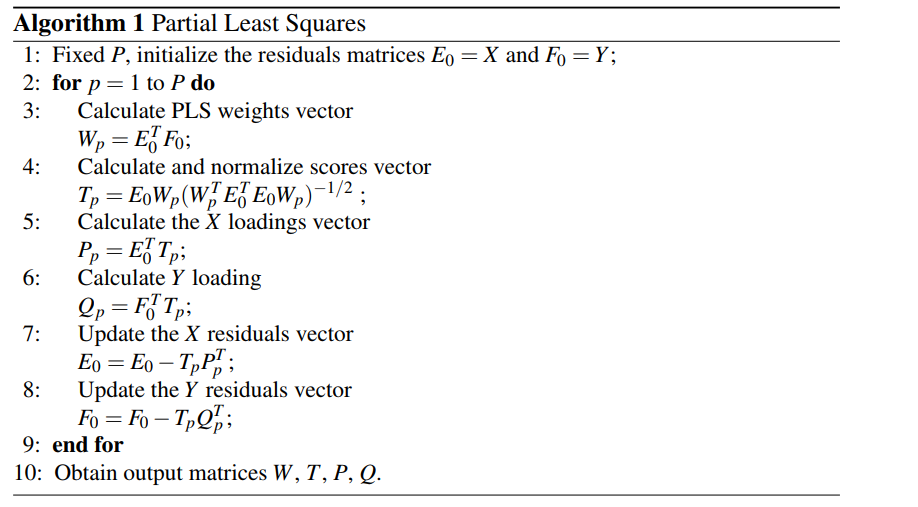
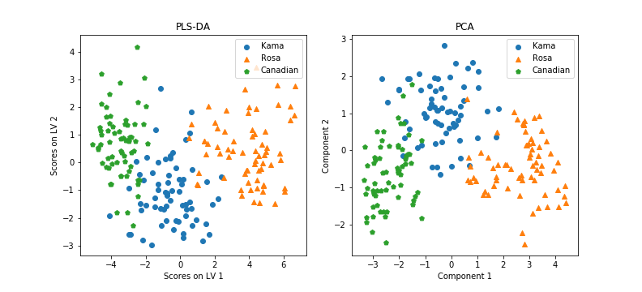

It may happen that you have a dataset with columns $X_1, ..., X_n, Y$, and you want to check if there is any correlation between $X_1, ..., X_n$ variables (or part of them) and the $Y$ variable. You know that correlation doesn't mean causation, but sometimes it would be useful to assess wether one could say anything on Y by looking at Xs variables, i.e. finding some vector $B$ that $Y \simeq XB$. A well known algorithm for such a task is the [Partial Least Squares Regression](https://data-farmers.github.io/2019-06-12-partial-least-squares-regression) (PLS-R), but it need Y variable to be continous, such as Xs; in case you have categorical variables, you can use a variant: Partial Least Squares Discriminant Analysis (PLS-DA). In a hypothetical taxonomy of ML methods, one could be doubtful about where to place PLS-DA, as it solves two problems with a single algorithm: (1) it encompassess a **feature dimensionality reduction** step, and (2) it provides a $B$ vector that can be reused for **predicting** $Y\star$ from future observations $X\star$.

## Purpose

Let's start from the dimensionality reduction task. You know your Xs variables (from now on: **predictors**) could be related somewhat to your Y (**response vector**), but X is high in dimensionality and you'd better use a subset - or a lower dimensional linear projection - of it. Let's call them **LV** (Latent Variables). Did you hear PCA? Yes, good point, I could say also LDA, but there are some differences between these algorithms that is going to affect your work significantly:


**PLS-DA vs LDA**: Some kind of data, spectral data for instance, tend to have more features than observations. In such a high-dimensional space, features are often correlated each other, a problem known as multicollinearity. Unlike PLS-DA, LDA cannot handle multicollinearity.


**PLS-DA vs PCA**: PCA is completely unsupervised, i.e. you don't know in advance if there are classes in your dataset, hence you simply project it into a space which maximizes the variance between your data, hopeful it will lead to a good qualitative clusterization. In PLS-DA, however, you know how your dataset is divided in classes from the response vector Y. The goal here is then to project the predictors into a space, while maximizing the between-group distances / within group distances ratio. PCA and PLS-DA projections will eventually be different.

Due to these differences, PLS-DA is the best choice when dealing with dataset with less observation than features, and you know which class each observation belongs to.
Hence we learned a transformation from the original n-dimensional spaced into the new L-dimensional space, where L is the number of Latent Variables, in a way that separates the most our data into the different classes. This mapping can turn useful in the future: if we gather new unlabelled data, we can map them through this projection, and accordingly classify them.

For this tutorial sake, we are going to focus on the dimensionality reduction task. Maybe the classification task will be tackled in a next tutorial.


## The algorithm

Remember the Multiple Linear Regression approach:

$$Y = BX + F$$

where X is the N x J matrix of predictors, B is the J x 1 vector containing the regression coefficients, Y the N x 1 response vector, and F a N x 1 error vector. Our goal is to find a B vector that minimize the error F, and the least squares solution is given by 

$$B = (X^{T}X)^{-1}X^{T}Y$$

When the matrix X has more feature than observations, $X^TX$ [can't be inverted](https://stats.stackexchange.com/questions/247720/why-is-within-class-scatter-matrix-in-lda-singular). A possible solution is to decompose X into L orthogonal scores T (N x L) and loading matrix P (J x L), and the response vector Y into L orthogonal scores T (N x L) and loading matrix Q (1 x L). Let's call E the N x J error matrix associated to X, and F the N x 1 error matrix associated to Y. In other words:

$$X = TP^T + E$$

$$Y = TQ^T + F$$

We define a weights matrix W (J x L) so we can re-write T as $T = XW(P^{T}W)^{-1}$, hence:

$$Y = XW(P^{T}W)^{-1}Q^{T} + F$$

from which, finally:

$$B = W(P^{T}W)^{-1}Q^{T}$$

Following Brereton and Lloyd's paper[[2]](https://onlinelibrary.wiley.com/doi/full/10.1002/cem.2609), we only need to estimate W, P, Q and T via the following algorithm:




## The code

PLS-DA is suitable for a categorical response vector. However, it still needs to be converted in numerical. We talked about a response vector Y, but we should have generalized to a response matrix Y, depending on the number of classes into our dataset. If we have 2 classes, the mapping with a N x 1 vector is very simple:

| Label | Y |
| :------ |:--- |
| A | 1 |
| B | 0 |

If we have more than 2 classes, say G, we need to make Y a dummy N x G matrix, with each row made by 0s but for a 1 pointing to the class an observation belongs to. Here follows the case with G = 3:

| Label | Y |
| :------ |:--- |
| A | [1, 0, 0] |
| B | [0, 1, 0] |
| C | [0, 0, 1] |


Let's code! First we need to transform our dataset as said before. We are gonna use once again our seed dataset, listing the properties of 3 classes of seeds. As the number of observation is way larger than the number of features, this may not be the perfect example, but hey, this is what our garden gives. In this example (you can find all the code [here](https://www.github.com/data-farmers/code/pls-da/)) we have a dataframe with a column, "Type", our original Y, and we need to unfold it into a N x 3 matrix as shown before. The first 7 columns, instead, represent our data, X.

Python's library `sklearn` is all we need for performing the PLS-DA algorithm. The syntax is very simple:


```python
from sklearn.cross_decomposition import PLSRegression

# 2 Latent Variables, no scaling
plsr = PLSRegression(n_components=2, scale=False)

# PLS-DA algorithm
plsr.fit(X, Y)

# Just print the resulting scores
plsr.x_scores_
```

`plsr.x_scores_` contains a N x 2 matrix, with the projection of each datapoint on each Latent Variable. We can plot this, if we want to plot our dataset into the new space:

)

Comments...


