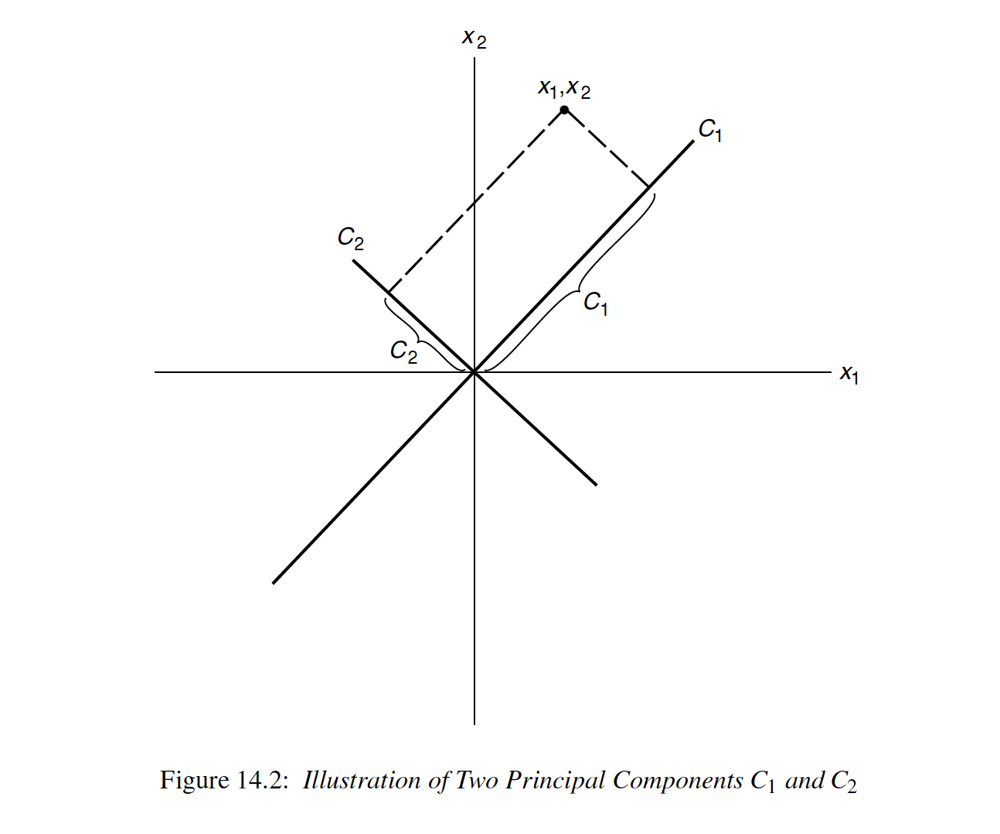

Principal components analysis (PCA) is used when a simpler representation is desired
for a set of intercorrelated variables. It is a method of transforming the original
variables into new, uncorrelated variables. The new variables are called the
principal components.

## Purpose
This analysis occurs when the dataset includes many variables displaying strong pairwise correlations, its main purposes are:
* reduce the number of variables from n to k where k < n,
* avoid loss of relevant information contained in the data.

Each principal component is a linear combination of the original variables. One measure of the amount of information conveyed by each principal component is its variance. For this reason the reduction of dimensionality is attained by retaining, in statistical analysis,
only the first components, i.e. those with larger variances, while the last components, i.e. the least informative (a variable with zero variance does not distinguish between the members of the population), are dropped. 
### Possible uses of principal components:
1. Regression modelling: reduce the number of predictors and rely on a selection of principal components. This helps avoiding problems of multicollinearity
2.  Test normality of variables: if the principal components are not normally distributed, neither are the original variables
3.  In segmentation problems where one wishes to cluster individuals according to some variables: if these are too many they can be replaced by principal components
4.  As an exploratory tool that allows for a better understanding of the relationships among variables [1](#myfootnote1).

Images taken from [1](#myfootnote1).

## The algorithm

## The code

{: .box-warning}
**Warning:** Following Sammon's definition, if the distance between two points _i_ and _j_ is 0, the algorithm will try a division by 0.
Check for your data points to be **non repeated**, or your code will crash!

**See also:** [PCA vs Sammon Sampling](http://hisee.sourceforge.net/Examples/Boquet.html)

<a name="myfootnote1">1</a>: Rencher A.C. and Christensen W.F. *Methods of Multivariate Analysis*, 3rd ed., Wiley, 2012

