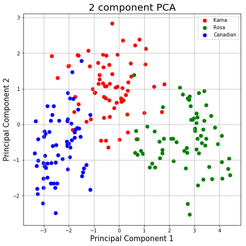
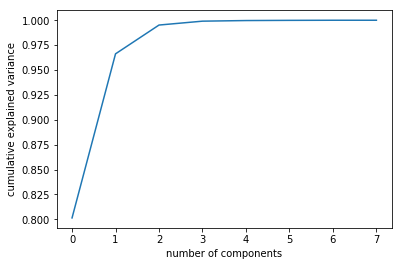

Principal components analysis (PCA) is used when a simpler representation is desired
for a set of intercorrelated variables. It is a method of transforming the original
variables into new, uncorrelated variables. The new variables are called the
principal components.

## Purpose
This analysis occurs when the dataset includes many variables displaying strong pairwise correlations, its main purposes are:
* reduce the number of variables from n to k where k < n,
* avoid loss of relevant information contained in the data.

Each principal component is a linear combination of the original variables. One measure of the amount of information conveyed by each principal component is its variance. For this reason the reduction of dimensionality is attained by retaining, in statistical analysis,
only the first components, i.e. those with larger variances, while the last components, i.e. the least informative (a variable with zero variance does not distinguish between the members of the population), are dropped. 

**Possible uses of PCA:**
1. Regression modelling: reduce the number of predictors and rely on a selection of principal components. This helps avoiding problems of multicollinearity
2.  Test normality of variables: if the principal components are not normally distributed, neither are the original variables
3.  In segmentation problems where one wishes to cluster individuals according to some variables: if these are too many they can be replaced by principal components
4.  As an exploratory tool that allows for a better understanding of the relationships among variables 
5. PCA for Data Visualization when the dimension are greater then 3<sup>[1](#myfootnote1)</sup>.

## The algorithm
Suppose our sample is made by $$\textbf{x}_{1}$$ ... $$\textbf{x}_{m}$$ indipendent drowing from some p-dimentional population with empirical mean shift to 0 and $\textbf{S}$ as sample covariance matrix.
The algorithm starts searching for the **first principal component** for every observation $i$, that is it tries to determne the coefficients of the linear combination given by

$$t_{1i}=a_{11}x_{1i}+a_{12}x_{2i}+\dots+a_{1n}x_{ni}$$ where $$i = 1 \dots m$$

that mazimize $$Var\(t_{1i}\) under the constraint $$\textbf{a_{1}'}\textbf{a_{1}}=1$$.

[comment]: <> (Images taken from <sup>[1](#myfootnote1)</sup>.)
A tricky part of using PCA in practice is to understand how many components are needed to describe the data. 
This can be determined by looking at the cumulative explained variance ratio as a function of the number of components:
This curve quantifies how much of the total, 64-dimensional variance is contained within the first N
components. 


## Cons:
* It is not possible to explain a very high proportion of the total variance with a small number of principal components. 
* Frequently in real-life situations, the interpretation of the components is not straightforward.


## The code

```python
import pandas as pd
from sklearn.decomposition import PCA
from sklearn.preprocessing import StandardScaler

# load dataset into Pandas DataFrame
df = pd.read_csv('../dataset/seeds.csv')

features = ['Area', 'Perimeter', 'Compactness', 'Kernel.Length', 'Kernel.Width', 'Asymmetry.Coeff', 'Kernel.Groove']
# Separating out the features
x = df.loc[:, features].values
# Separating out the target
y = df.loc[:,['Type']].values
# Standardizing the features
x = StandardScaler().fit_transform(x)

pca = PCA(n_components=2)
principalComponents = pca.fit_transform(x)
principalDf = pd.DataFrame(data = principalComponents
             , columns = ['principal component 1', 'principal component 2'])
```


#### Choosing the number of component
```python
pca = PCA().fit(df)
plt.plot(np.cumsum(pca.explained_variance_ratio_))
plt.xlabel('number of components')
plt.ylabel('cumulative explained variance')
plt.savefig('pca_ncomp.png', bbox_inches='tight')
```


{: .box-warning}
**Warning:** PCA is effected by scale so you need to scale the features in your data.** If you want to see the negative effect not scaling your data can have, scikit-learn has a section on the effects of not standardizing your data. [HERE](https://scikit-learn.org/stable/auto_examples/preprocessing/plot_scaling_importance.html#sphx-glr-auto-examples-preprocessing-plot-scaling-importance-py).

**See also:** [PCA vs Sammon Sampling](http://hisee.sourceforge.net/Examples/Boquet.html)


<a name="myfootnote1">1</a>: Rencher A.C. and Christensen W.F. *Methods of Multivariate Analysis*, 3rd ed., Wiley, 2012

