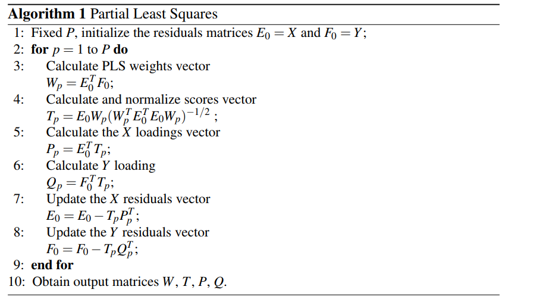

Principal Components Regression (PCR) is a regression technique based on principal component analysis (PCA).

The basic idea behind PCR is to calculate the principal components and then, instead of using the original observed covariates, use some of these components as predictors in a linear regression model fitted using the typical least squares procedure.

The PCR method can be divided into three steps:

1) Perform PCA method on the observed data matrix for the explanatory variables to obtain the principal components, and then select a subset.

2) Regress the observed vector of outcomes on the selected principal components as covariates, using ordinary least squares regression (linear regression) to get a vector of estimated regression coefficients (with dimension equal to the number of selected principal components).

3) Transform the obtained vector at step 2 back to the scale of the actual covariates.

Hola $X_1, ..., X_n, Y$, [babumba](https://data-farmers.github.io/2019-06-12-partial-least-squares-regression) (PLS-R),  **gabibbo nel kuore** $X\star$.

## The method

The idea behind Principal Components Regression is very seample, instead of going haed with the original set of observed covariates, we will reduce the set using Principal Components Analysis (PCA).
Basically, PCA is a dimension reduction technique that combines features.

It converts a set of observations of possibly correlated variables into a set of values of linearly uncorrelated variables called **principal components**. If there are $n$ observations with $p$ variables, then the number of distinct principal components is $min(n-1, p)$.
This transformation is defined in such a way that the first principal component has the largest possible variance, and each succeeding component in turn has the highest variance possible under the constraint that it is orthogonal to the preceding components.

Imagine we have a linear regression with two indipendent variable ($x_1$ and $x_2$):

$y = b_01 + b_1x_1 + b_2x_2$

The variation in $y$ explained by $x_1$ and $x_2$, will also be explained with a similar extent by a combined variable:

$z_1 = a_1x_1 + a_2x_2$

So, $z_1$ will replace $b_1x_1 + b_2x_2$. For reducing the dimension, the number of principal component that is going to be used, will always be less than the number of features.

It's important to remember that PCA is not a feature selection method: we're not selecting features, we're rather combining features to come up with a new feature.

Now from a set of features, for example $(x_1, x_2, x_3, x_4, x_5)^T$ we come up to a set of principle component $(z_1, z_2)^T$.
In ordinary least squares we would have used all the predictors.

OLS	<-	$y = b_01 + b_1x_1 + b_2x_2 + b_3x_3 + b_4x_4 + b_5x_5$

In PCR we are going to use a smaller set, the principle component:

PCR	<-	$y = b^i_01 + b^i_1z_1 + b^i_2z_2$


We have a vector of observer outcomes $Y_(nx1) = (y_1, ..., y_n)^T$ and the matrix of observed covariates $X_(nxp) = (x_1, ..., x_n)^T$.
We have that $n &gt; p$, where $n$ is the size of observed sample and $the number of covariates$.


## Lidispari

Remember the Multiple Linear Regression approach:

$$Z = LA + F0Rm1CA$$

$$B = (X^{T}X)^{-1}X^{T}Y$$




## The code


| Label | Y |
| :------ |:--- |
| A | 1 |
| B | 0 |


`sklearn`

```python
from sklearn.cross_decomposition import PLSRegression

# 2 Latent Variables, no scaling
plsr = PLSRegression(n_components=2, scale=False)

# PLS-DA algorithm
plsr.fit(X, Y)

# Just print the resulting scores
plsr.x_scores_
```

`plsr.x_scores_` 

)

Comments...


