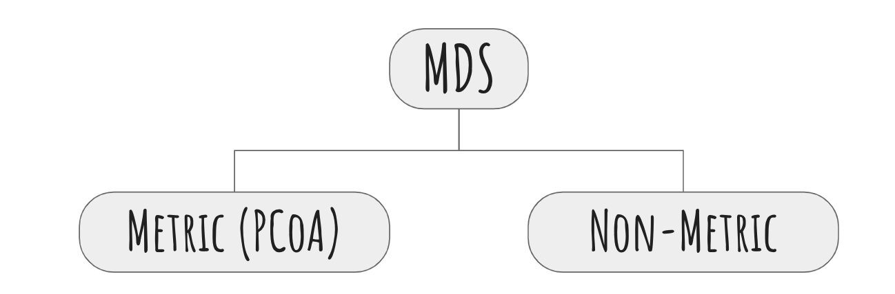
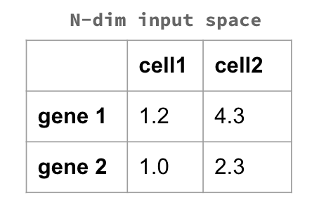

Multidimensional scaling (MDS) is one of the many methods for dimensionality reduction. Actually, it more a *family* of techniques rather than a single method, whose goal is to produce a mapping of our N-dimensional data in a lower dimensionality space.

We can distinguish between __metric__ (henceforth simply MDS) and __non-metric__ (NMDS) dimensional scaling.

## Metric MDS

Metric MDS is a generalization of a well known method for dimensionality reduction: Principal Component Analysis (__PCA__). Therefore, for those who already know PCA, MDS' workflow will sound very familiar. 

__Metric__ MDS consists in projecting our data in a lower-dimensionality space through eigenvalue decomposition. We start from our N-Dimension input space

and we proceed in calculating a __distance__ between our datapoints. This could be any distance - Euclidean, Manhattan, Hamming... it really depends on the context and on the problem we are facing. For example, the image above shows an excerpt of a dataset in which each entry is a gene, and each value is somehow related to the presence of that gene in each cell. In this case, we would calculate the distance between each entry of our input space: the genes. This would tell us how far - how different - they are one with the other.

Once that we get this _distance matrix_ D, which is still N-dimensional, we want to resize it to a k-dimensional space. This happens through _eigenvalue decomposition_: we compute the _k_ eigenvalues and the related eigenvectors (actually we do this after _double centering_ the matrix, but I will not go too much into the algebra of it, since this is something usually the machine deals with).

If all this reminds you of the PCA, this is because it is _exactly_ what happens for the PCA. The only difference is that here we are dealing with distances, while the PCA is based on correlation. Minimizing a linear distance is equivalent to maximizing a linear correlation: the resulting output of PCA and of MDS with Euclidean distance will be exactly the same.

## Non-metric MDS

NMDS is rather different from metric MDS, since it is no longer based on eigenvalue decomposition. This has an important consequence: the linearity assumption falls, and this makes NMDS suitable for whenever we do not think there is a linear relationship between variables.

NMDS is based on an iterative procedure: after having decided the number __m__ of dimensions for the reduced input space, we begin constructing an initial configuration of the data in m-dimensions. We then proceed in arranging the positions of the data points, by minimising a loss function. This loss function is usually the __stress__ function, that captures the difference between distance in the reduced dimension compared to the complete multidimensional space.

## Caveats and use cases

There are different things that we should consider when picking up one of the above methods. The choice really depends on the kind of data one is dealing with - usually, PCA works for most of the cases. If a linear relationship between variables is assumed, but one does not want to use Euclidean distance, metric MDS can still be a possibility. If none of these assumptions holds, NMDS can be a good solution: it is suitable for user-defined metrics, that can be domain-specific, and can easily deal with any kind of data, like counts, ratios, intervals etc. Nonetheless, there are drawbacks for NMDS:

-	NMDS is an iterative process and, as such, it can fall in local minima;
-	For huge datasets, it can be computationally heavy;
-	Always remember that we are not dealing with an eigenvector method like MDS. This means that axes are non-metric, and have no actual meaning.