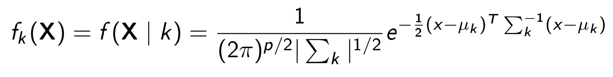
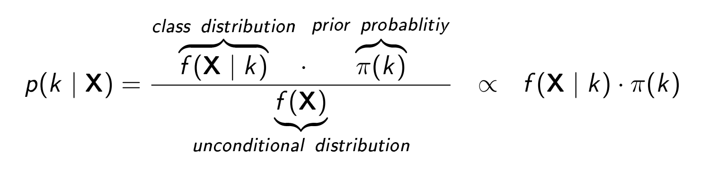

Often (?!) we have to deal with questions like ‘are the groups different?’, ‘on what variables, are the groups most different?’, ‘can one predict which group a person belongs to using such variables?’ In answering such questions, discriminant analysis is quite helpful.

Today I'll present the following approaches to discriminant analysis:
-	Linear Discriminant Analysis,
-	Quadratic Discriminant Analysis,
-	Regularized Discriminant Analysis,


##Discriminant Analysis

The purpose of discriminant analysis is to assign objects to one
of several (K) groups based on a set of measurements obtained from each object $X = (X_1, X_2, ..., X_p)$.
Each object is assumed to be a member of one (and only one) group $1 ≤ k ≤ K$ and, obviously, an error is incurred if the object is attached to the wrong group. The measurements of all objects of one class k are
characterized by a probability density $f_k(X)$ and we want to find a rule to decide for every object to wich group k it belongs to.

**Example**

Let's make an exmple to better understand what we're taliking about.
We've a group of people, male and famale. We just know weight and height of each person in the group and we want to classify the gender for each person from the weight and height (discriminant analysis).
So we have $K = 2$ (two groups) and $p = 2$ (two kind of measurements). 
We have a classification rule (discriminant function) to choose the group for each person and to costruct this function we use a training sample in which the gender is already known.

##Linear Discriminant Analysis (LDA)

Linear Discriminant Analysis assumes that the joint density of all features ($X$), conditional on the target's class ($k$) in a multivariate normal distribution. This means that the density function ($f$) of the features X, given the target is in class k, are assumed to be given by



where $\mu$ and $\sum_k$ are the class k $(1 \le k \le K)$ population mean vector ($\mu$) and covariance matrix ($\sum_k$).

The decision boundary between two classes, say k and l, is the **hyperplane** on which the probability of belonging to either class is the same. This implies that, on this hyperplane, the difference between the two densities (and hence also the log-odds ratio between them) should be zero.

An important assumption in LDA is that the Gaussians for different classes share **the same covariance matrix**.

To calculate the density of the features, $f(X|k)$, we just have to estimate the Gaussian parameters: the means $\mu_k$ as the sample means and the covariance matrix $\sum$ as the empirical sample covariance matrix. Having calculated this, the probability of the target belonging to class k can be obtained from the Bayes rule:



An object si assigned to class $k_i$ if it has the biggest posterior probability $p(k_i|X)$. This is equal to minimizing the expected loss.

where P(y=k) is the prior probability of belonging to class k and can be estimated by the the proportion of k-class observations in the sample.

Note that LDA has **no hyperparameters** to tune.

## LDA code

```python
from sklearn.cross_decomposition import PLSRegression

#Read the dataset
df = pd.read_csv('seeds.csv')
X = df.iloc[:,0:7]
y = df['Type']

#Create train set and test set
train, test, train_lbl, test_lbl = train_test_split(X, y, test_size=1/7.0, random_state=0)

#Scale the data: mean 0 and variance 1 
scaler = StandardScaler()
# Fit on training set only.
scaler.fit(train)
train = scaler.transform(train)
test = scaler.transform(test)

pca = PCA(n_components=nc)
pca.fit(train)
train = pca.transform(train)
test = pca.transform(test)

```

##Quadratic Discriminant Analysis

We've said that before that 