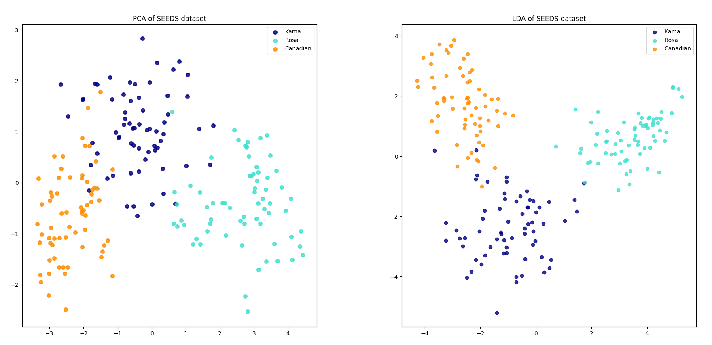
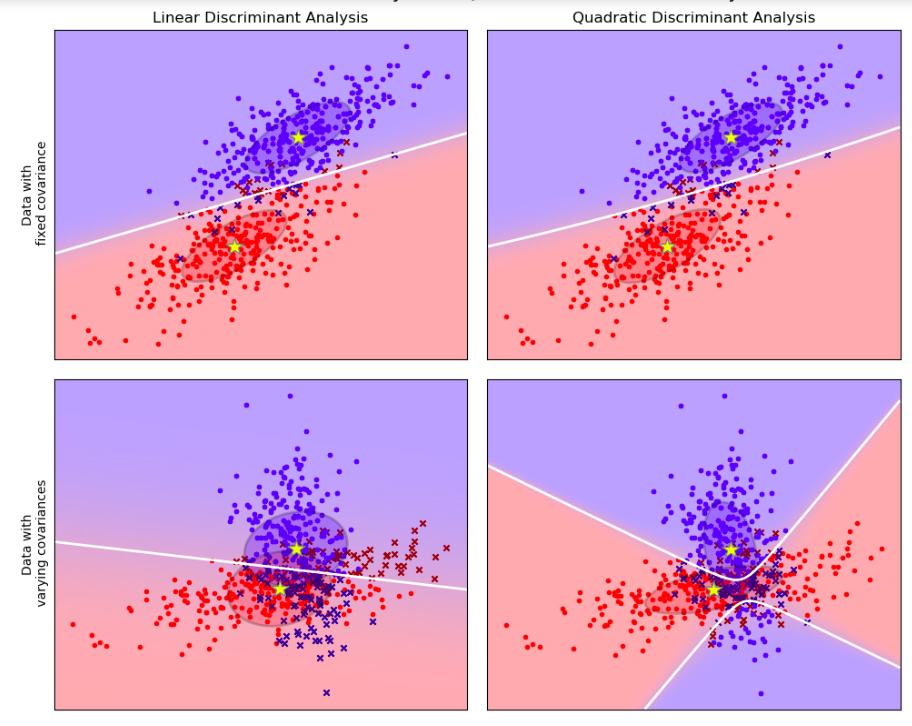
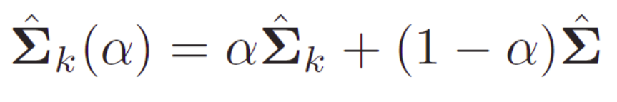

Often (?!) we have to deal with questions like ‘are the groups different?’, ‘on what variables, are the groups most different?’, ‘can one predict which group a person belongs to using such variables?’ In answering such questions, discriminant analysis is quite helpful.

Today I'll present the following approaches to discriminant analysis:
-	Linear Discriminant Analysis,
-	Quadratic Discriminant Analysis,
-	Regularized Discriminant Analysis,

## Discriminant Analysis

The purpose of discriminant analysis is to assign objects to one
of several (K) groups based on a set of measurements obtained from each object $X = (X_1, X_2, ..., X_p)$.
Each object is assumed to be a member of one (and only one) group $1 ≤ k ≤ K$ and, obviously, an error is incurred if the object is attached to the wrong group. The measurements of all objects of one class k are
characterized by a probability density $f_k(X)$ and we want to find a rule to decide for every object to wich group k it belongs to.

**Example**

Let's make an exmple to better understand what we're taliking about.
We've a group of people, male and famale. We just know weight and height of each person in the group and we want to classify the gender for each person from the weight and height (discriminant analysis).
So we have $K = 2$ (two groups) and $p = 2$ (two kind of measurements). 
We have a classification rule (discriminant function) to choose the group for each person and to costruct this function we use a training sample in which the gender is already known.

## Linear Discriminant Analysis (LDA)

Linear Discriminant Analysis assumes that the joint density of all features ($X$), conditional on the target's class ($k$) in a multivariate normal distribution. This means that the density function ($P$) of the features $X$, given the target $y$ is in class $k$, are assumed to be given by

$P(X \|  y=k)=\frac{1}{(2\pi)^{\frac{d}{2}} \|  \sum_k \|  ^\frac{1}{2}}exp(-\frac{1}{2}(X-\mu_k)^t\sum_k^1(X - \mu_k))$

where $\mu$ and $\sum_k$ are the class $k$ $(1 \le k \le K)$ population mean vector ($\mu$) and covariance matrix ($\sum_k$).

The decision boundary between two classes, say k and l, is the **hyperplane** on which the probability of belonging to either class is the same. This implies that, on this hyperplane, the difference between the two densities (and hence also the log-odds ratio between them) should be zero.

An important assumption in LDA is that the Gaussians for different classes share **the same covariance matrix**.

To calculate the density of the features, $P(X\  \|  y=k)$, we just have to estimate the Gaussian parameters: the means $\mu_k$ as the sample means and the covariance matrix $\sum$ as the empirical sample covariance matrix. Having calculated this, the probability of the target belonging to class k can be obtained from the Bayes rule:

$P(y=k  \|  X) = \frac{P(X  \|  y=k)P(y=k)}{P(X)}$

where $P(y=k)$ is the prior probability of belonging to class k and can be estimated by the the proportion of k-class observations in the sample.

Note that LDA has **no hyperparameters** to tune.

## LDA and PCA

Principal Component Analysis (PCA) identifies the combination of attributes (principal components) that account for the most variance in the data. Here we plot the different samples on the 2 first principal components.

Linear Discriminant Analysis (LDA) tries to identify attributes that account for the most variance between classes. In particular, LDA, in contrast to PCA, is a supervised method, using known class labels.

## Quadratic Discriminant Analysis

We've said before that LDA has an importan assumption: Gaussians for different classes share **the same covariance matrix** but this might be incorrect for particular data.
The left column in the picture below shows how LDA performs for data that indeed come from a multivariate Gaussians with a common covariance matrix (upper pane) versus when the data for different classess have different covariances (lower pane).

In this case we have to estimate not one but $k$ covariance and, if there are many features, this can lead to an increase of the number of parameters in the model.

## Regularized Discriminant Analysis

In the linear regression context, subsetting means choosing a subset from available variables to include in the model, thus reducing its dimensionality. **Shrinkage**, on the other hand, means reducing the size of the coefficient estimates (shrinking them towards zero).
Note that if a coefficient gets shrunk to exactly zero, the corresponding variable drops out of the model. Consequently, such a case can also be seen as a kind of subsetting.
Shrinkage and selection aim at improving upon the simple linear regression. Linear regression estimates tend to have low bias and high variance. Reducing model complexity (the number of parameters that need to be estimated) results in reducing the variance at the cost of introducing more bias.
Just like linear models for regression can be regularized to improve accuracy, so can linear classifiers. We can introduce a shrinking parameter $\alpha$ that shrinks the separate covariance matrices of QDA towards a common LDA matrix:

The shrinkage parameter can take values from 0 (LDA) to 1 (QDA) and any value in between is a compromise between the two approaches. The best value of $\alpha$ can be choosen based on cross-validation.

